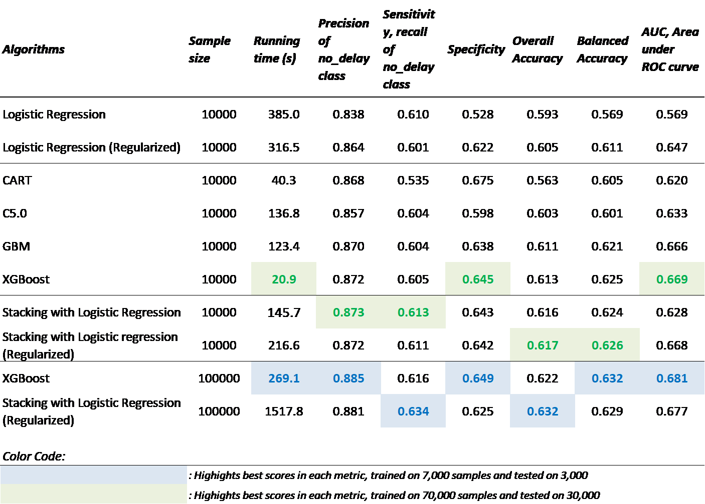
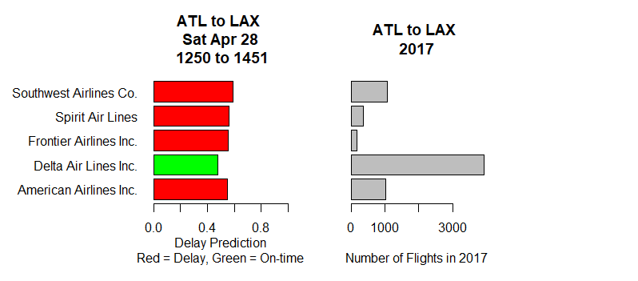

# us_airline_delay_prediction_

something

### Methodology

Regularized logistic regression is a form of logistic regression designed to be less sensitive to overfitting, therefore, it outperforms logistic regression likely because there could be overfitting due to the flexibility of the large number of features created by the one-hot-encoding. It is impressive that the test set accuracy metric is competitive with tree-based boosting algorithm C5.0. While both of them are designed to be robust to overfitting, C5.0 is able to detect the relevancy of features by performing implicit variable selection, as well as capture high-order interactions of the data.

The single tree-based algorithm, CART, was considered because the results could be useful in illustrating the superiority of boosting-based algorithms. C5.0 was added in because of the same reason, i.e. to compare tree-boosting algorithms with gradient-boosting algorithms. The results were reasonably obvious when they were judged based on both overall and balanced accuracy test scores, XGBoost is undeniably the best model among all tree-based algorithms, coming in at 61.3% and 62.5% respectively. Although XGBoost’s scores only differed in the 3rd decimal place from the runner up model, GBM, the running time of XGBoost favourably trumps every algorithm, taking only 20.9 seconds to train. When matched with remarkable gradient boosting algorithms, performance of CART and C5.0 were flat out overtaken, which is coherent given the underlying framework of their limitations. The predictors include some numeric features, which could cause instability in the case of CART, mostly because small changes in the variable could result in a completely different tree structure. C5.0 is very susceptible to overfitting when it picks up data with uncommon characteristics, and as we might expect to find, the ARR_TIME_BINS and DEP_TIM_BINS do have some noise in the early hours.

One of the improvements of XGBoost over GBM is the penalization of complexity, which was not common for additive tree models. The penalization part helps to avoid overfitting, stemming from its ability to control complexity. In a nutshell, XGBoost excels in performance because it uses a more regularized model formalization to control over-fitting, compared to other forms of gradient boosting. Other than being robust enough to support fine tuning and addition of regularization parameters, it also leverages the structure of computer hardware to speed up computing times and facilitate memory usage (Reinstein, 2017).

The best models in terms of overall and balanced accuracy are Stacking with logistic regression, XGBoost and Stacking with regularized logistic regression. For the best model, the balanced accuracy is 0.626. This means that the average of sensitivity and specificity is 62.6%, made up of a sensitivity of 61.1% and a specifiticity of 64.2%. In other words, 61.1% of the on-time flights were correctly classified, and 64.2% of the delayed flights were correctly classified. Since 23% of all 2017 domestic flights were delayed, we would naively expect any particular flight to have a 23% chance of being delayed. Simply put, if our model predicts that a flight will be delayed, there is a 64.2% chance that it will be right, which is 41% higher than the 23% chance that a flight would be delayed by guessing. On the other hand, if our model predicts that a flight is on time, it will only be correct 61.1% of the time, which is 15.9% less than the 77% chance that a flight would be on time by guessing. Since our goal was to provide a model that meaningfully predicts on-time and delayed flights equally well, we are encouraged that we managed to obtain relatively balanced predictions.

While our model is not perfect, we are pleased that it provides an increase from 23% to 61.7% in probability of correctly predicting whether a flight is delayed. Furthermore, our prediction of both on-time and delayed flights is fairly balanced, which helps provide meaningful results. 

### Application of Model

To implement our model, we developed a Flight Delay Prediction System in R that takes in basic information about a prospective flight from the user and then displays delay predictions for each carrier that flew that route in 2017.  Figure 10 shows the inputs and outputs of the system.  For ease of use, some features are generated internally, such as the distance between the airports, the origin airport state, the destination airport state, and the carriers.  In the output, a red bar is shown beside each airline for which the model predicts the flight would be delayed while a green bar is shown beside each airline for which the model predicts the flight would be on-time, as shown in Figure 11.  The length of the bars is an indication of how certain the model is: the longer the bar the more confident the model is that the flight will be delayed.  For 30,000 test flights, the overall accuracy of the model was 62.2% i.e. its prediction of whether flights were delayed or not was correct 62.2% of the time.

Users may also find it useful to know which airlines typically fly the route they are interested in.  Another plot, beside the delay predictions, shows the total number of flights that each airline flew from the origin airport to the destination airport in 2017; only airlines that flew the route are shown.  Of course, airline schedules may change, but this gives the user a pretty good idea of which airlines have been the main carriers on a route.  For example, of the five airlines that flew from Atlanta Georgia to Los Angeles California in 2017, Delta flew by far the most flights.  This makes sense because Atlanta (ATL) and Los Angeles (LAX) are both Delta hubs.

*Figure 10: Overview of Inputs and Outputs of Flight Delay Prediction System *

*Figure 11: Output of Flight Delay Prediction System for Flight from Atlanta to Los Angeles departing at 12:50 and arriving at 14:51 on Saturday April 28*

---

