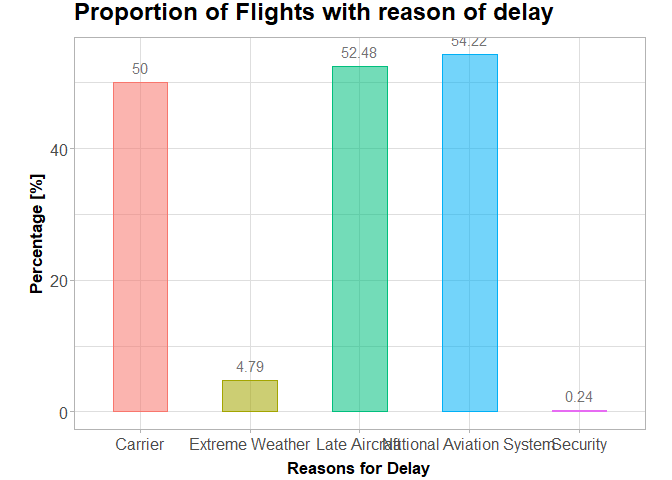
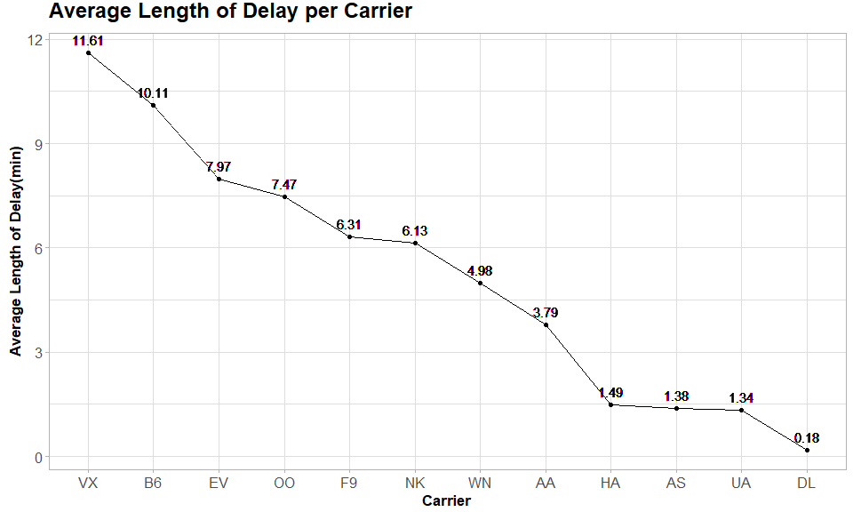
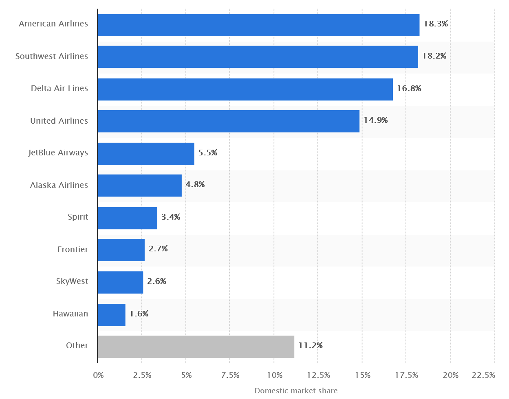
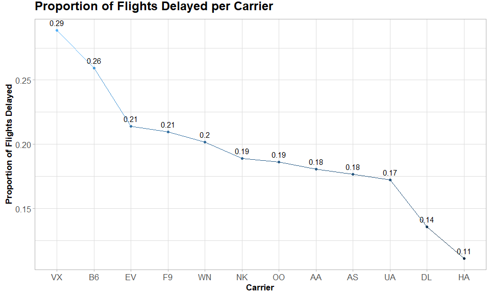
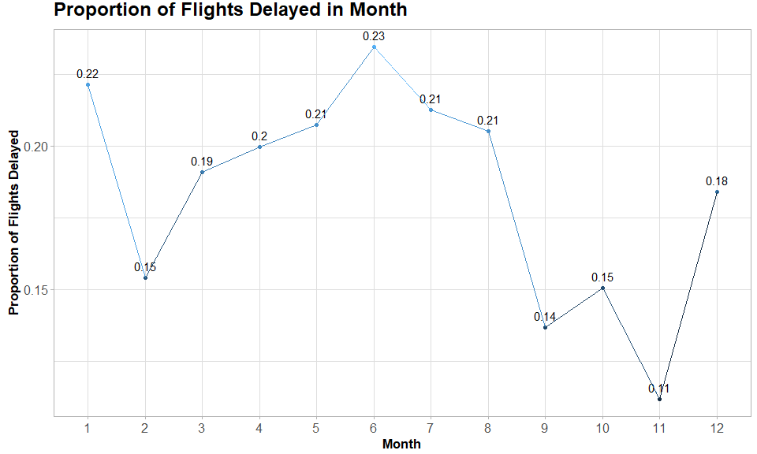
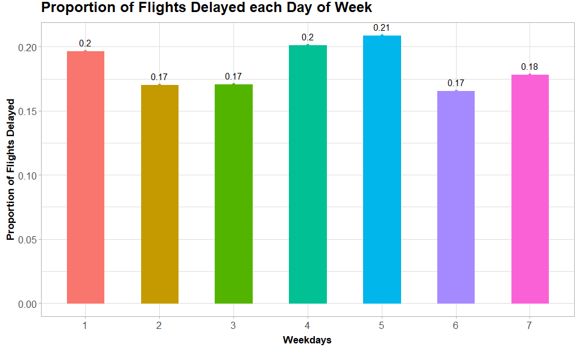
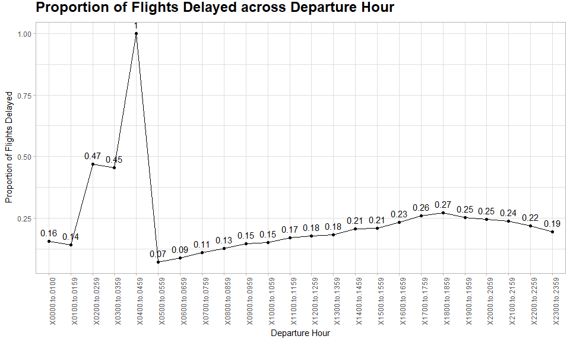
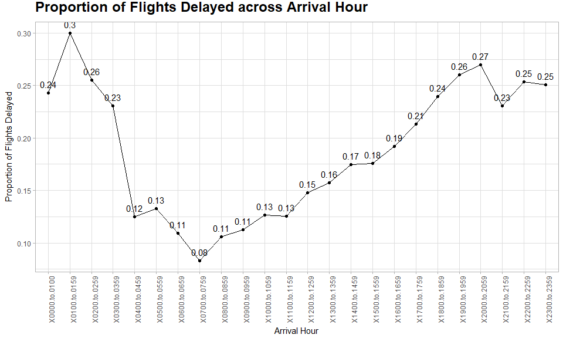
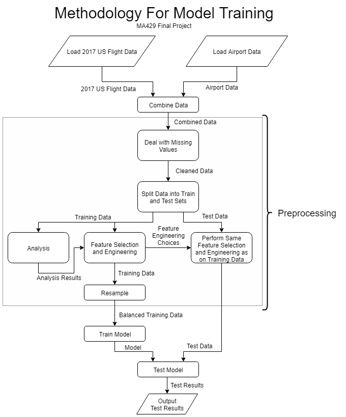

## Introduction

This markdown document shows a summary of the 20-page report for the final year project of MA429 Algorithmic Techniques for Data Mining. 


Flight delays are a frequently occurring reality of commercial air travel. In 2017, 23% of all domestic flights in the United States, over a million flights, were delayed. Flights are considered on-time if they arrive less than 15 minutes after their scheduled arrival time, according to the United States Bureau of Transportation Statistics. 

Delayed flights can cause hassle for passengers who may have to wait longer than planned, miss connecting flights, or arrive late for critical meetings. While many people would prefer to avoid delays, many popular flight booking websites such as kayak.com, skyscanner.net, and hipmunk.com, do not display predicted delay information to aid them in doing so. Google Flights only recently added a feature to predict flight delays as reported by Tech Crunch in January 2018. Knowing the likelihood of any particular flight being delayed would help people make informed decisions on which flights to book.

**The aim of this project was to use historical data to develop a model for a flight delay prediction system**, where the goal of the system is to provide flight delay information at the time of booking to help people avoid delayed flights. The model developed will be deployed within a system that takes in basic flight details and displays predicted delay information to the user to help compare the likelihood of flight delays for different airlines.

---

## Data
The United States Department of Transportation’s website’s many years of data is available by
month. However, over time, changes in airline procedures, regulations, scheduling systems, demand
and other factors make older data less relevant for predicting delays for flights in 2018. Looking only
at the most recent month would not be able to utilize any information that is unique between
months. Considering these factors, it was chosen to use data from all 12 months in 2017.

The 2017 data on domestic flights in the United States contains 5,674,621 observations on flights between 320 airports operated by 12 carriers. It comes at about 680MB in size in CSV format. Fortunately, we were able to compressed it into a convenient 47MB RData file, courtesy to R's built-in functions. 

---

## Investigation
Let's dive into the most intriguing part of the machine learning process---**Data visualization**. 

The following data shown has been preprocessed with the script: ```source("scripts/mainForAnalysis.R")```. More details can be found in it. We skip it to bring you the juicy bits right away.

---


Take a look at the preprocessed data. We see four different types of data: numeric, categorical, binary, and date. Accessing the types of data available is crucial in making data visualization decision. Just with the inclusion of a date feature immediately imply we may be dealing with time series plots, i.e. plots that show how a variable change along with time. 


```
## 'data.frame':	68812 obs. of  47 variables:
##  $ MONTH                               : Factor w/ 12 levels "1","2","3","4",..: 4 5 11 3 11 1 3 9 7 9 ...
##  $ DAY_OF_MONTH                        : Factor w/ 31 levels "1","2","3","4",..: 19 9 5 5 3 2 6 3 17 16 ...
##  $ DAY_OF_WEEK                         : Factor w/ 7 levels "1","2","3","4",..: 3 2 7 7 5 1 1 7 1 6 ...
##  $ FL_DATE                             : Date, format: "2017-04-19" "2017-05-09" ...
##  $ AIRLINE_ID                          : int  19790 19790 19930 19393 20304 20409 19790 19805 19790 19393 ...
##  $ CARRIER                             : Factor w/ 12 levels "AA","AS","B6",..: 4 4 2 12 9 3 4 1 4 12 ...
##  $ TAIL_NUM                            : Factor w/ 4792 levels "","N001AA","N002AA",..: 952 3857 539 3462 36 3846 4233 457 437 1762 ...
##  $ FL_NUM                              : int  2050 2541 414 2875 5342 54 2337 2017 1908 2770 ...
##  $ ORIGIN_AIRPORT_ID                   : Factor w/ 312 levels "10135","10136",..: 209 87 270 261 81 227 79 278 168 51 ...
##  $ DEST_AIRPORT_ID                     : Factor w/ 312 levels "10135","10136",..: 173 19 227 284 49 157 19 65 157 25 ...
##  $ CRS_DEP_TIME                        : int  1259 1130 2310 1035 1130 2025 1833 1649 2240 1705 ...
##  $ CRS_ARR_TIME                        : int  1659 1438 2356 1605 1311 2259 2029 2035 720 1815 ...
##  $ ARR_DELAY                           : num  0 -17 41 -23 10 47 -22 -19 22 -9 ...
##  $ ARR_DEL15                           : Factor w/ 2 levels "0","1": 1 1 2 1 1 2 1 1 2 1 ...
##  $ CANCELLED                           : num  0 0 0 0 0 0 0 0 0 0 ...
##  $ CANCELLATION_CODE                   : Factor w/ 5 levels "","A","B","C",..: 1 1 1 1 1 1 1 1 1 1 ...
##  $ DIVERTED                            : num  0 0 0 0 0 0 0 0 0 0 ...
##  $ CRS_ELAPSED_TIME                    : num  180 128 46 210 161 154 116 226 340 70 ...
##  $ FLIGHTS                             : num  1 1 1 1 1 1 1 1 1 1 ...
##  $ DISTANCE                            : num  1183 743 129 1557 850 ...
##  $ DISTANCE_GROUP                      : int  5 3 1 7 4 5 2 6 10 2 ...
##  $ CARRIER_DELAY                       : num  NA NA 22 NA NA 25 NA NA 11 NA ...
##  $ WEATHER_DELAY                       : num  NA NA 0 NA NA 0 NA NA 0 NA ...
##  $ NAS_DELAY                           : num  NA NA 19 NA NA 22 NA NA 4 NA ...
##  $ SECURITY_DELAY                      : num  NA NA 0 NA NA 0 NA NA 0 NA ...
##  $ LATE_AIRCRAFT_DELAY                 : num  NA NA 0 NA NA 0 NA NA 7 NA ...
##  $ DELAY_GROUPS                        : Factor w/ 7 levels "no_delay","delay.1.to.15.mins",..: 1 1 4 1 2 5 1 1 3 1 ...
##  $ CRS_DEP_TIME_MINS                   : num  779 690 1390 635 690 ...
##  $ CRS_ARR_TIME_MINS                   : num  1019 878 1436 965 791 ...
##  $ CRS_DEP_TIME_MINS_SQUARED           : num  606841 476100 1932100 403225 476100 ...
##  $ CRS_ARR_TIME_MINS_SQUARED           : num  1038361 770884 2062096 931225 625681 ...
##  $ DEP_TIME_BINS                       : Factor w/ 24 levels "X0000.to.0100",..: 13 12 24 11 12 21 19 17 23 18 ...
##  $ ARR_TIME_BINS                       : Factor w/ 24 levels "X0000.to.0100",..: 17 15 24 17 14 23 21 21 8 19 ...
##  $ ORIGIN_AIRPORT_LAT                  : num  30 41.5 47.4 32.7 39.8 ...
##  $ ORIGIN_AIRPORT_LONG                 : num  -90.3 -93.7 -122.3 -117.2 -104.9 ...
##  $ DEST_AIRPORT_LAT                    : num  40.8 33.6 45.6 38.7 34.2 ...
##  $ DEST_AIRPORT_LONG                   : num  -73.9 -84.4 -122.6 -90.4 -118.4 ...
##  $ ORIGIN_AIRPORT_SIZE                 : num  46876 8173 137176 84056 223165 ...
##  $ DEST_AIRPORT_SIZE                   : num  93326 364655 62666 56988 25129 ...
##  $ ORIGIN_AIRPORT_STATE_NAME           : Factor w/ 50 levels "","Alabama","Alaska",..: 18 15 47 6 7 9 35 1 6 20 ...
##  $ DEST_AIRPORT_STATE_NAME             : Factor w/ 50 levels "","Alabama","Alaska",..: 32 10 37 25 6 32 10 33 32 8 ...
##  $ ORIGIN_DISPLAY_AIRPORT_NAME         : Factor w/ 312 levels "Aberdeen Regional",..: 170 69 265 257 277 215 133 234 169 97 ...
##  $ DEST_DISPLAY_AIRPORT_NAME           : Factor w/ 312 levels "Aberdeen Regional",..: 153 16 230 155 123 135 16 73 135 33 ...
##  $ ORIGIN_DISPLAY_CITY_MARKET_NAME_FULL: Factor w/ 291 levels "Aberdeen, SD",..: 193 72 252 242 71 282 68 244 165 279 ...
##  $ DEST_DISPLAY_CITY_MARKET_NAME_FULL  : Factor w/ 291 levels "Aberdeen, SD",..: 193 15 219 262 164 193 15 50 193 116 ...
##  $ ORIGIN_AIRPORT                      : Factor w/ 312 levels "ABE","ABI","ABQ",..: 209 86 270 261 80 227 78 278 168 25 ...
##  $ DEST_AIRPORT                        : Factor w/ 312 levels "ABE","ABI","ABQ",..: 173 19 227 284 50 157 19 64 157 25 ...
```


Out of approximately 5.7 million observations on flights between 320 airports, 1,029,474 of these flights were delayed by 15 minutes or more. If we were to give a naive probability estimate to the chance of delay, it would be astonishingly close to 20%! 

In the data, reasons for delay is recorded in numeric format, i.e. if the feature ```CARRIER_DELAY``` is ```15```, it means the flight delay was caused by "carrier"-related reasons for a total of 15 minutes. The following table shows each reason of delay in its shortform and description. 

| Reasons for Delay        | Description                                                  |
| ------------------------ | ------------------------------------------------------------ |
| Carrier                  | Delays due to circumstances within the airline’s control such as maintenance or crew problems, aircraft cleaning, baggage loading, and fueling. |
| Extreme Weather          | Tornadoes, blizzards, and hurricanes.                        |
| Late Aircraft            | Refers to a previous flight with the same aircraft arriving late causing the current flight to arrive late. |
| National Aviation System | Non-extreme weather conditions, airport operations, heavy traffic volume, and air traffic control . |
| Security                 | Security issues.                                             |


<!-- -->
The largest three reasons that delays are attributed to are the National Aviation System, late aircraft and carriers. This makes a lot of sense because delayed airlines most likely cause a domino effect, making subsequent flights even more delayed. Likewise, in the category of carrier, delays are very susceptible to human errors because workers are responsible of maintenance, baggage handling and fueling.

Also, it was observed that most delayed flights were attributed to more than one reason.

---


Let us investigate further by looking at the carriers and their average length of delay:

<!-- -->

In terms of carrier, Virgin America (VX), JetBlue Airlines (B6) and ExpressJet Airlines Inc (EV) . have the longest average length of delay, as well as highest proportion of delayed flights. In contrast, United Air Lines Inc. (UA), Delta Air Lines Inc. (DL), Alaska Airlines Inc. (AS) and Hawaiian Airlines Inc. (HA) perform best with the shortest length of delay and smallest proportion of delayed flights. Well, it is hard to determine what is the actual cause in this case. We can only speculate at best. Take a look at the chart below. It depicts the domestic market share of leading U.S. airlines. 

The table below is taken from [The Statistics Portal: Domestic market share of leading U.S. airlines from April 2017 to March 2018](https://www.statista.com/statistics/250577/domestic-market-share-of-leading-us-airlines/)



As speculated, market share does hold some degree of influence towards the average length of delay. Delta Airlines, United Airlines and American Airlines are major contenders in terms of market shares, and all of them have distinguishably lower average delay than other airlines. In addition, Alaska Airlines seems to be the anomaly here. They achieved a relatively low rate of delay compared to its neighbour in terms of market shares---Jetblue Airlines.

---


Evaluating only the average length of delay would not be enough to conclude which carrier did worse in terms of delays. This time, We assess the proportion of flights delayed per carrier:


<!-- -->

The United States Bureau of Transportation Statistics define "delayed flight" to be a carrier that is delayed for more than 15 minutes. It is clear that this chart's pattern closely mirrors the previous chart. Quite frankly, from this point on, We can be more certain about which are the worst carriers in terms of getting delayed. 

---


What about the month people choose to fly? Does flying in say, Christmas period, have higher chances of getting delayed? 

<!-- -->

This simple line graph definitely shows some interesting inferences. Proportion of flights delayed peaked in the month of June, July and August, which happens to be the months of summer. Why is this the case? Well, it's really not hard to find out. Googling... 

*"Why does my flight always get delayed during summer?"*

Turns out it is actually harder for planes to fly in hot air because the air itself becomes much less dense. Sparser air molecules means the plane's wings generate less lift, making takeoff more difficult. In other words, if it gets too hot out, airlines will delay or cancel flights altogether until things cool down. In June 2017, [American Airlines](https://eu.usatoday.com/story/travel/nation-now/2017/06/19/its-so-hot-phoenix-they-cant-fly-planes/410766001/) grounded 20 flights out of Phoenix Sky Harbor International Airport due to intense heat.

Overall, time-related features show distinguishable patterns. November was the best month for travellers with the shortest average delay and smallest proportion of delayed flights. 

---


<!-- -->
Flight delay patterns also fluctuate on a weekly basis. Average length of delay and proportion of
delayed flights are highest on Mondays and Fridays, while lowest on Saturdays. Although the difference was not that significant, the pattern does make some sense because most business travellers fly outbounds on Monday and return to office by the end of week.

---


Let's do the same analysis for arrival and departure hours:

<!-- -->
<!-- -->

Both plots have pretty clear trends. Within a day, average length of delay and proportion of delayed flights both fluctuate wildly in the early morning, and then climb up steadily to the delay peak around 20:00 and 21:00. The peaks in the morning can be misleading, considering that the effect of a single delayed flight will be quite visible on the delayed proportion, given the small number of domestic flights that take off in the early morning. The increasing trend of delay could be explained by the
accumulated influence of delays earlier in the day.

---


## Feature Engineering ideas

The above visualizations are only a subset of the plots produced for this project. Since this is still a modelling project, the goal of producing the above plots is to make informed decisions on feature selection. 

The *Proportion of Flights Delayed across Arrival Hours* plot shows the relationship between average arrival delay and scheduled flight arrival time (CRS_ARR_TIME). From the plot, there appears to be a linear relationship between arrival delay and scheduled flight arrival time – the later in the day the more severe delay flights tend to be. Therefore, scheduled flight arrival time, originally in the format of “hhmm” for a 24-hour clock, if converted to a numerical variable, would be better suited to capture this relationship. A function was created to convert this feature to minutes after midnight. For example, 1:30 a.m. which was recorded as 130 in the original data, and was converted to 90 minutes after midnight by the function. 

In another attempt to capture some of quadratic-looking pattern in the scheduled arrival and
departure times with average arrival delay (i.e. delay rising steadily in throughout the day, but falling again after around 20:00), the square of the minutes after midnight for each of the two times was added. (These features did not bring any improvement to just adding the minutes after minute
however, and so were dropped.)

Intuitively congestion may have an effect on delays and congestion could be related to the number
of flights an airport serves. For each flight, two new features were added. One for the size of the
origin airport and one for the size of the destination airport, where the size of an airport was
determined as the total number of flights originating from that airport in 2017. The inclusion of
these variables, however, reduced balanced accuracy to around 0.59 and they were only sometimes
included in the top 20 most important variables of the model so they were also dropped. 

We discretized the numerical features: CRS_ARR_TIME, CRS_DEP_TIME, MONTH, DAY_OF_WEEK,
DAY_OF_MONTH, and included them as features. The intuition for this is that, by converting them
into bins, models can effectively capture the non-linear patterns in the data.

---


### Methodology




---


### Summary and Interpretation of Results


Regularized logistic regression is a form of logistic regression designed to be less sensitive to overfitting, therefore, it outperforms logistic regression likely because there could be overfitting due to the flexibility of the large number of features created by the one-hot-encoding. It is impressive that the test set accuracy metric is competitive with tree-based boosting algorithm C5.0. While both of them are designed to be robust to overfitting, C5.0 is able to detect the relevancy of features by performing implicit variable selection, as well as capture high-order interactions of the data.

The single tree-based algorithm, CART, was considered because the results could be useful in illustrating the superiority of boosting-based algorithms. C5.0 was added in because of the same reason, i.e. to compare tree-boosting algorithms with gradient-boosting algorithms. The results were reasonably obvious when they were judged based on both overall and balanced accuracy test scores, XGBoost is undeniably the best model among all tree-based algorithms, coming in at 61.3% and 62.5% respectively. Although XGBoost’s scores only differed in the 3rd decimal place from the runner up model, GBM, the running time of XGBoost favourably trumps every algorithm, taking only 20.9 seconds to train. When matched with remarkable gradient boosting algorithms, performance of CART and C5.0 were flat out overtaken, which is coherent given the underlying framework of their limitations. The predictors include some numeric features, which could cause instability in the case of CART, mostly because small changes in the variable could result in a completely different tree structure. C5.0 is very susceptible to overfitting when it picks up data with uncommon characteristics, and as we might expect to find, the ARR_TIME_BINS and DEP_TIM_BINS do have some noise in the early hours.

One of the improvements of XGBoost over GBM is the penalization of complexity, which was not common for additive tree models. The penalization part helps to avoid overfitting, stemming from its ability to control complexity. In a nutshell, XGBoost excels in performance because it uses a more regularized model formalization to control over-fitting, compared to other forms of gradient boosting. Other than being robust enough to support fine tuning and addition of regularization parameters, it also leverages the structure of computer hardware to speed up computing times and facilitate memory usage (Reinstein, 2017).

The best models in terms of overall and balanced accuracy are Stacking with logistic regression, XGBoost and Stacking with regularized logistic regression. For the best model, the balanced accuracy is 0.626. This means that the average of sensitivity and specificity is 62.6%, made up of a sensitivity of 61.1% and a specifiticity of 64.2%. In other words, 61.1% of the on-time flights were correctly classified, and 64.2% of the delayed flights were correctly classified. Since 23% of all 2017 domestic flights were delayed, we would naively expect any particular flight to have a 23% chance of being delayed. Simply put, if our model predicts that a flight will be delayed, there is a 64.2% chance that it will be right, which is 41% higher than the 23% chance that a flight would be delayed by guessing. On the other hand, if our model predicts that a flight is on time, it will only be correct 61.1% of the time, which is 15.9% less than the 77% chance that a flight would be on time by guessing. Since our goal was to provide a model that meaningfully predicts on-time and delayed flights equally well, we are encouraged that we managed to obtain relatively balanced predictions.

While our model is not perfect, we are pleased that it provides an increase from 23% to 61.7% in probability of correctly predicting whether a flight is delayed. Furthermore, our prediction of both on-time and delayed flights is fairly balanced, which helps provide meaningful results. 

---


### Application of Model

To implement our model, we developed a Flight Delay Prediction System in R that takes in basic information about a prospective flight from the user and then displays delay predictions for each carrier that flew that route in 2017.  Figure 10 shows the inputs and outputs of the system.  For ease of use, some features are generated internally, such as the distance between the airports, the origin airport state, the destination airport state, and the carriers.  In the output, a red bar is shown beside each airline for which the model predicts the flight would be delayed while a green bar is shown beside each airline for which the model predicts the flight would be on-time, as shown in Figure 11.  The length of the bars is an indication of how certain the model is: the longer the bar the more confident the model is that the flight will be delayed.  For 30,000 test flights, the overall accuracy of the model was 62.2% i.e. its prediction of whether flights were delayed or not was correct 62.2% of the time.

Users may also find it useful to know which airlines typically fly the route they are interested in.  Another plot, beside the delay predictions, shows the total number of flights that each airline flew from the origin airport to the destination airport in 2017; only airlines that flew the route are shown.  Of course, airline schedules may change, but this gives the user a pretty good idea of which airlines have been the main carriers on a route.  For example, of the five airlines that flew from Atlanta Georgia to Los Angeles California in 2017, Delta flew by far the most flights.  This makes sense because Atlanta (ATL) and Los Angeles (LAX) are both Delta hubs.


*Figure 10: Overview of Inputs and Outputs of Flight Delay Prediction System *


*Figure 11: Output of Flight Delay Prediction System for Flight from Atlanta to Los Angeles departing at 12:50 and arriving at 14:51 on Saturday April 28*

---


### Conclusion

To corroborate the classifier generated in this data mining project, we pitted our best model’s results against a flight delay prediction competition hosted by CrowdAnalytix.com in 2016 (CrowdANALYTIX, 2016). Our best model, XGBoost, when trained on 70,000 flights, achieved an AUC score of 68.1%. Interestingly enough, **this result is competitive with the top submissions in the competition, and would have achieved a rank of 19th out of 664 submissions**, where the winning solution achieved an AUC score of 70.9%. Although the data we used and the data the competition provided came from the same source and included similar features, (BUREAU OF TRANSPORTATION  STATISTICS, 2018), the data used in the competition was from the year 2014 to 2015. Therefore, this comparison can only be taken with a pinch of salt. Nevertheless, it shows that the results of our work are competitive and further improvements could still be made by engineering better features and trying different ensembles or methods.

Although optimising models is an imperative aspect of a data mining task, we also developed a functional implementation of our predictive model.  This guided our choice of features to only those that could be inputted by a user or computed at the time of booking a flight, which could be months in advance.  Using only these limited features, we were able to develop a data mining model trained on 2017 data that is capable of correctly classifying 62.2% of flights.  This model was then integrated into a flight delay system in R that produces plots of predicted delays for the relevant airlines for a flight of interest.  The output plot, which can be generated at the time of booking a flight, enables the user to easily compare which airlines are likely to have flight delays.  Further possibilities exist to enhance the model’s predictive ability, adjust the format of the output, and to deploy the model into more refined flight search tools. 

